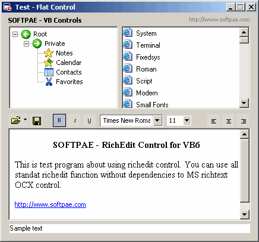



## SOFTPAE \- VB Controls \(update\) / Dead for OCX

### Description

Absolute super code based on Paul Caton "Win Sub Hook" sample !! You do not need OCX later, only one vb CTL file for control. Create new control is simple - use template. This controls is used in B++ Builder IDE. To use it in design time, copy files from "required" folder to system folder... see readme.txt. Please, vote for me :)
 
### More Info
 

             |
---                |---
**Submitted On**   |2003-09-21 17:20:00
**By**             |[Anthonius](https://github.com/Planet-Source-Code/PSCIndex/blob/master/ByAuthor/anthonius.md)
**Level**          |Intermediate
**User Rating**    |5.0 (15 globes from 3 users)
**Compatibility**  |VB 5\.0, VB 6\.0
**Category**       |[Object Oriented Programming \(OOP\)](https://github.com/Planet-Source-Code/PSCIndex/blob/master/ByCategory/object-oriented-programming-oop__1-47.md)
**World**          |[Visual Basic](https://github.com/Planet-Source-Code/PSCIndex/blob/master/ByWorld/visual-basic.md)
**Archive File**   |[SOFTPAE\_\-\_1648579222003\.zip](https://github.com/Planet-Source-Code/anthonius-softpae-vb-controls-update-dead-for-ocx__1-48692/archive/master.zip)

